# Goblin Mod Maker Documentation

## Table of Contents

- [Goblin Mod Maker Documentation](#goblin-mod-maker-documentation)
  - [Table of Contents](#table-of-contents)
  - [Main Menu](#main-menu)
    - [Mods](#mods)
      - [New Mod](#new-mod)
      - [Open/Load Mod](#openload-mod)
      - [Open/Load Mod from .gmm file](#openload-mod-from-gmm-file)
      - [Multiple File Compilation](#multiple-file-compilation)
    - [Settings Window](#settings-window)
  - [Editor Menu](#editor-menu)
    - [Files](#files)
      - [New Mod](#new-mod-1)
      - [Open Mod](#open-mod)
      - [Save Mod](#save-mod)
      - [New File](#new-file)
      - [Save C# File](#save-c-file)
    - [Edit](#edit)
      - [Change Mod Name](#change-mod-name)
      - [Change Mod Version](#change-mod-version)
      - [Change Mod Developers](#change-mod-developers)
    - [Create](#create)
      - [Create Harmony Patch](#create-harmony-patch)
      - [Create Config Item](#create-config-item)
      - [Create Keybind](#create-keybind)
    - [Build](#build)
      - [Build and Install](#build-and-install)
      - [Generate Dotnet Files](#generate-dotnet-files)
    - [Tools](#tools)
      - [Search](#search)
      - [Go To Line](#go-to-line)
  - [Shortcuts](#shortcuts)
  - [Fonts](#fonts)
    - [JetBrains Mono:](#jetbrains-mono)
    - [Fira Code:](#fira-code)
    - [Cascadia Code:](#cascadia-code)
  - [Themes](#themes)
    - [Isle Goblin:](#isle-goblin)
    - [Light:](#light)
    - [Dark:](#dark)
    - [Midnight:](#midnight)
    - [Forest:](#forest)
    - [Ocean:](#ocean)
    - [Retro:](#retro)
  - [Tutorials](#tutorials)
    - [Creating your own theme](#creating-your-own-theme)
      - [Good To Know](#good-to-know)
      - [Getting Started](#getting-started)
      - [Custom Assets](#custom-assets)
      - [Change Themeing](#change-themeing)
        - [Preperation](#preperation)
        - [Changing Custom Asset Paths](#changing-custom-asset-paths)
        - [Changing Theme Values](#changing-theme-values)
    - [Adding Custom Fonts](#adding-custom-fonts)
  - [Errors](#errors)
    - [Known Errors](#known-errors)
      - [Mod Menu Not Showing Up](#mod-menu-not-showing-up)
  - [Support](#support)
    - [Discord Server](#discord-server)
      - [If you join our discord server you can get support from the devs and community!](#if-you-join-our-discord-server-you-can-get-support-from-the-devs-and-community)

---

## Main Menu

### Mods

#### New Mod

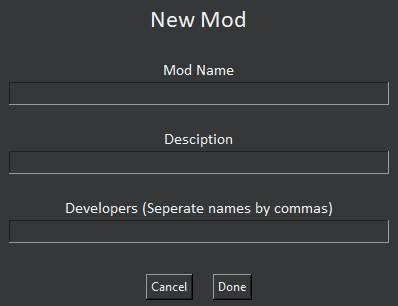

- **Mod Name:** This is where you enter the name of your mod. Can be changed later.
- **Description:** This is a description of your mod for the manifest.json file. Can be changed in manifest.json after building.
- **Developers:** If entering multiple, seperate with a comma. Can be changed later.

---

#### Open/Load Mod

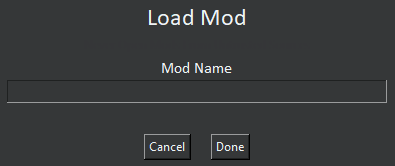

- **Mod Name:** The name of the mod(without spaces) you want to open. If you forgot or it isn't working go to `[gmm folder] > projects`. Find the mod you want, copy its name, and paste that into the input field

---

#### Open/Load Mod from .gmm file

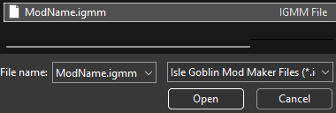
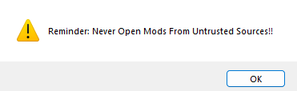

- **On Opening**
  1. A warning pops up letting you know to not open mods from untrusted sources
  2. A file dialog pops up prompting you to find the location of the mod
  3. After selecting the `.gmm` file, the mod will open up in the editor
- **Note:** If you have any `.ugmm` or `.igmm` that you want to use in GMM try renaming it from that to `.gmm`

#### Multiple File Compilation

- When building a mod what ever .cs files are located in the files folder in your project will be built into the .dll
- You can use a .dll decompiler such as dnSpy to view your mod

---

### Settings Window

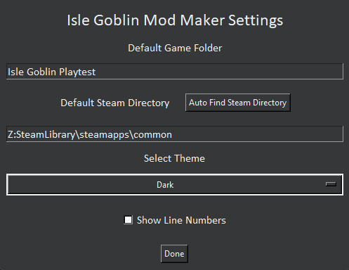

- **Default Game Folder:** Set to Isle Goblin Playtest because of the current beta version of the game.
- **Default Steam Directory:** Can be found automatically (RECOMMENDED), the common folder where steam games are held.
- **Select Themes:** A dropdown box to select themes. automatically scans themes. See the Making Your Own theme section below. Will reapply theme on startup
- **Show Line Numbers:** If checked line numbers will be shown in the text editor.
- **Selected Font:** Choose from 3 pre-loaded fonts or add your own fonts by dragging `.ttf` files into `{gmm folder}>resources>fonts`

---

## Editor Menu

### Files

#### New Mod

- **Path:** `File > New Mod`
- **Use:** Same thing as [New Mod](#new-mod)

---

#### Open Mod

- **Path:** `File > Open Mod`
- **Use:** Same thing as [Open Mod](#openload-mod)

---

#### Save Mod

- **Path:** `File > Save Mod`
- **Use:** Saves the mod as a `.gmm` file that gets stored in `{gmm} > projects > {mod name}`

---

#### New File

- **Path:** `File > Save C# File`
- **File Name:** This is the name that the file will be created as. Stored in `{gmm} > projects > {mod name}>files`

---

#### Save C# File

- **Path:** `File > Save C# File`
- **Use:** Saves the .cs file thats is currently being edited `{gmm} > projects > {mod name} > files`

---

### Edit

#### Change Mod Name

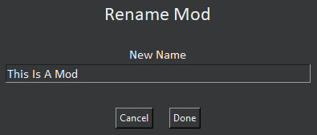

- **Path:** `Edit > Change Mod Name`
- **New Name:** The name that your mod will be renamed to.
  - ex: *The Ultimate Goblin Mod*

---

#### Change Mod Version

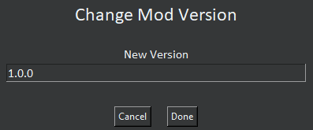

- **Path:** `Edit > Change Mod Version`
- **New Version:** The version number your mod will be changed to.
  - Semantic versioning recommended (major.minor.patch). Example: `1.3.0` where:
    - **Major:** 1
    - **Minor:** 3
    - **Patch:** 0
  - ex: *1.0.1*

---

#### Change Mod Developers

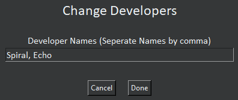

- **Path:** `Edit > Change Mod Developer`
- **Developer Names:** Enter the name(s) of the developer(s) working on the mod. Separate names with commas.
  - ex: *Watt, Matt*

---

### Create

#### Create Harmony Patch

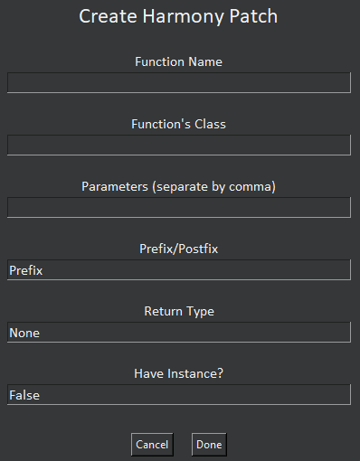

- **Path:** `Create > Create Harmony Patch`
- **Function Name:** This is the name of the method that you want to patch in the target class.
  - ex: *Attack*
- **Function Class:** This is the class that contains the method you want to patch. You must specify the class name where the target method is defined.
  - ex: *AttackManager*
- **Parameters (seperated by comma):** These are the parameters of the method being patched, separated by commas. You need to provide the parameter types and names in the format `Type paramName`. If you don’t need to modify certain parameters, they can be left out of this list.
  - ex: *float damage, bool critical*
- **Prefix/Postfix:** This determines whether the patch should be applied *before*(Prefix) or *after*(Postfix) the original method.
  - ex: *Prefix*
- **Return Type:** This specifies the return type of the method you want to patch. If the original method returns a value and you want to override or manipulate the result, you can specify it here. If there is no return value, it can be set to None.
  - ex: *string*
- **Have Instance?:** This determines if the patch has access to the instance of the class. If true, the patch will have access to `__instance`, which allows it to interact with instance-specific data.
  - ex: *True*

`these examples are just examples they are not connected to the game`

---

#### Create Config Item

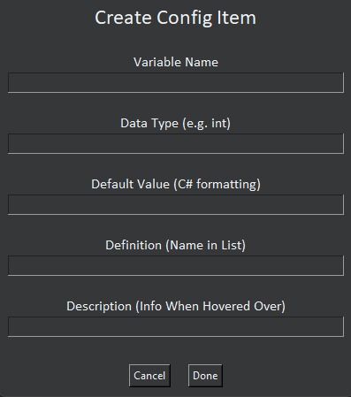

- **Path:** `Create > Create Config Item`
- **Variable Name:** This is the name of the config variable that will be used in the code.
  - ex: *maxHealth*
- **Data Type:** This defines the type of data the config item will hold. Common data types include `int`, `float`, `bool`, `string`, etc.
  - ex: *int*
- **Default Value (C# Formatting):** This is the default value for the config item. It must be provided in proper C# format. For instance, strings should be wrapped in quotes, booleans should be true or false, ints as-is, floats with a `f` a the end, etc.
  - ex: *100*
- **Definition:** This is the display name that appears in the config list (usually in the game’s settings UI). It’s a human-readable name for the setting.
  - ex: *Max Health*
- **Description (Info When Hovered Over):** This provides additional information about the config item. It’s typically shown when the user hovers over the setting in the UI, helping them understand what the setting does.
  - ex: *The maximum health the player can have*

`these examples are just examples they are not connected to the game`

---

#### Create Keybind

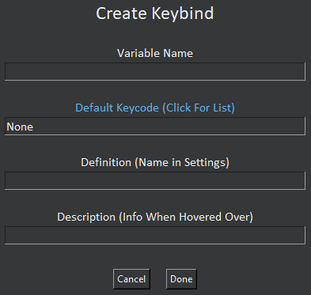

- **Path:** `Create > Create Keybind`
- **Variable Name:** This is the name of the keybind variable that will be used in the code.
  - ex: *"dashKey"*
- **[Default Keycode (Click For List)](https://docs.unity3d.com/ScriptReference/KeyCode.html):** This specifies the default key that the keybind will be mapped to when first initialized. The value should be a valid Unity `KeyCode`. For a full list, click on the label, which opens the Unity KeyCode documentation.
  - ex: *LeftShift*
- **Definition (Name in Settings):** This is the display name that appears in the settings menu for the keybind. It’s the name users will see when configuring the keybind in the UI.
  - ex: *Dash*
- **Description (Info When Hovered Over):** This provides additional information about the keybind. It’s typically shown when the user hovers over the keybind setting in the UI, explaining what the keybind does.
  - ex: *Press to dash*

`these examples are just examples they are not connected to the game`

---

### Build

#### Build and Install

- **Path:** `Build > Build and Install`
- **Description:** This option builds your mod in `[gmm folder] > projects > [mod name]` and then copies it into a folder named after your mod in `Isle Goblin Playtest > BepInEx > plugins`.
  - The folder will also include a `manifest.json`, `CHANGELOG.md`, and `README.md`.
  - It is recommended to adjust these files to match your mod.

---

#### Generate Dotnet Files

- **Path:** `Build > Generate Dotnet Files`
- This option generates and exports all dotnet files for your mod, including the C# code, a `.csproj` file, a manifest, and other a few other resources.
- These files are located at `[gmm folder] > projects > [mod name]`. The structure includes:
  - `[mod name].cs`
  - `[mod name].csproj`
  - `manifest.json`
  - `README.md`
  - `CHANGELOG.md`
  - `Libraries` folder (containing required game and BepInEx libraries)

---

### Tools

#### Search

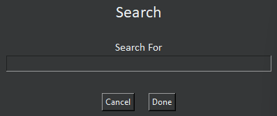

- **Path:** `Tools > Search`
- **Description:** Allows you to search for text in the code.

---

#### Go To Line

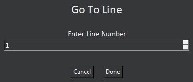

- **Path:** `Tools > Go To Line`
- **Description:** Enter a line number and it will take you directly to that line in the code.
- **Note:** To view line numbers, ensure they are enabled in the settings.

---

## Shortcuts

| Shortcut        |        What it does |
| :-------------- | ------------------: |
| Ctrl+ Shift + T |   Opens up last tab |
| Ctrl + Q        |        Close editor |
| Ctrl + S        |   Save current file |
| Ctrl + Z        |                Undo |
| Ctrl + Y        |                Redo |
| Ctrl + +/=      | Increases font size |
| Ctrl + -        | Decreases font size |

## Fonts
**There are 3 pre-packaged fonts you can choose to use in the code editor.**

### JetBrains Mono:
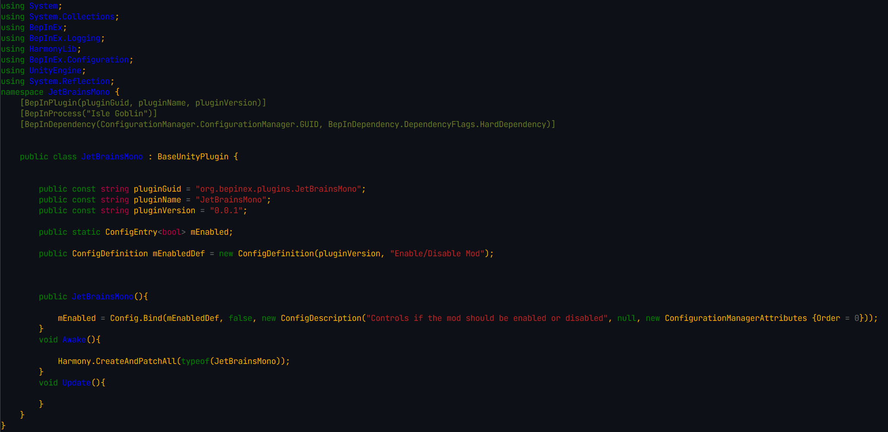

### Fira Code:
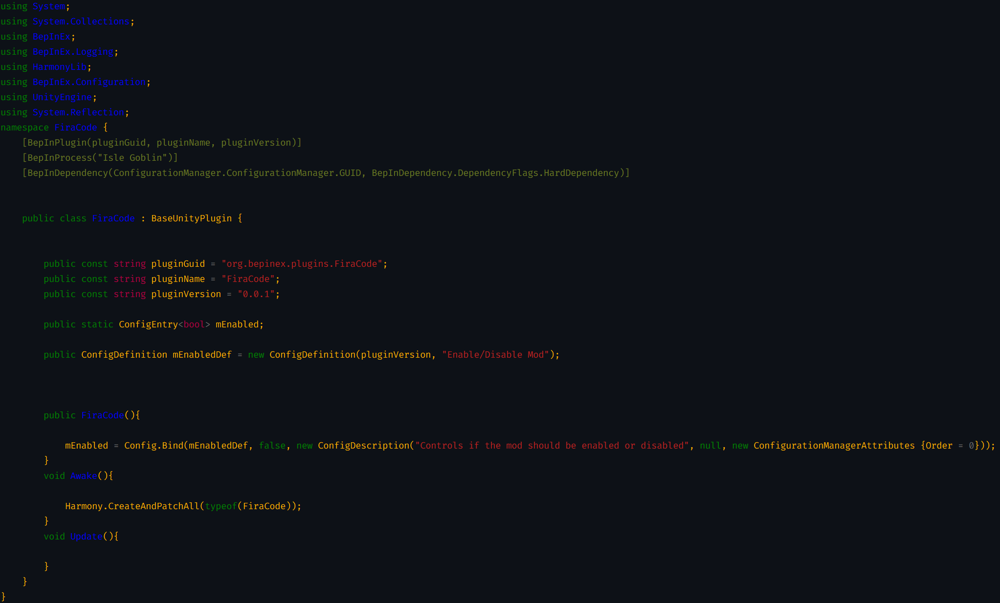

### Cascadia Code:
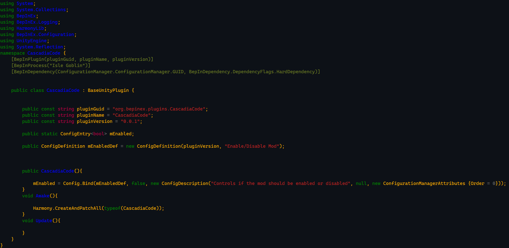

---

## Themes
**GMM comes pre-packaged with 7 unique themes to choose from. You can always [create your own theme](#creating-your-own-theme).**

### Isle Goblin:

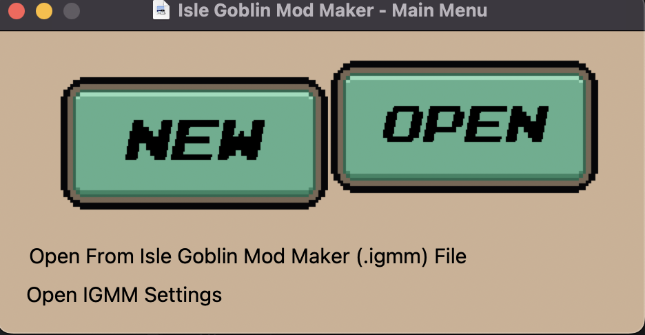

### Light:

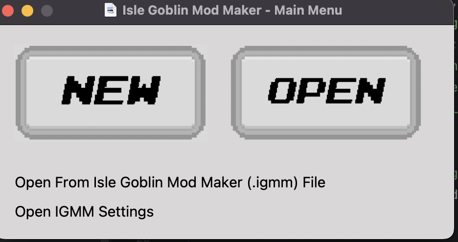

### Dark:

### Midnight:

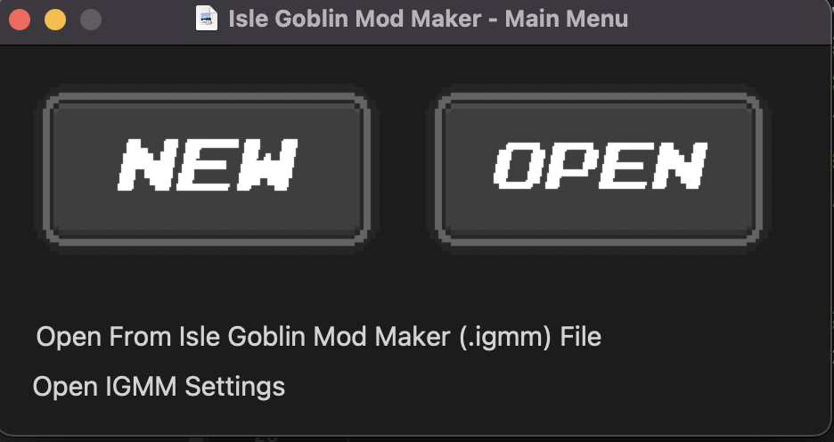

### Forest:

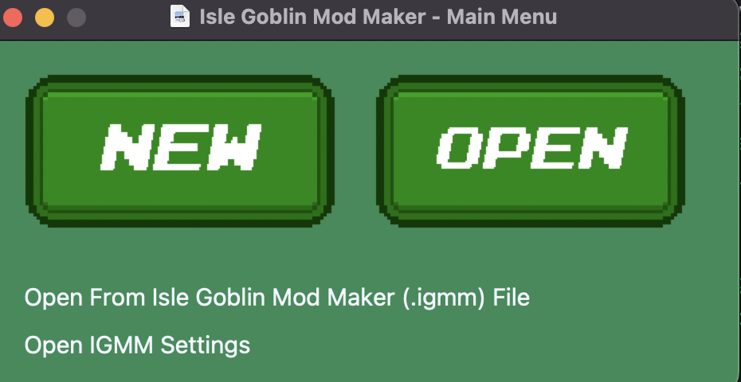

### Ocean:

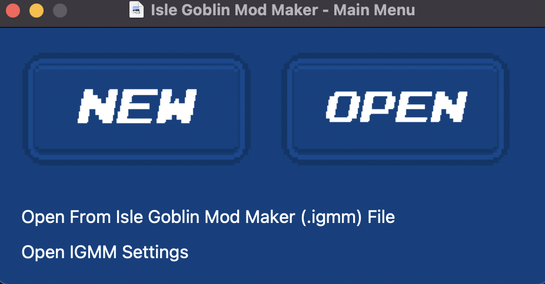

### Retro:

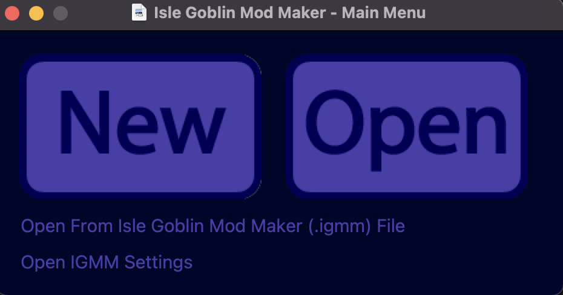

---

## Tutorials

### Creating your own theme
#### Good To Know
- Themes are loaded via `{gmm} > resources > themes`
- It loads them by searching for `.json` files
- You can change the new and open button images and change the click and hover SFX

#### Getting Started
1. Locate the themes folder `{gmm} > resources > themes`
2. Duplicate the Isle Goblin.json file
3. Rename this file to the name of your theme (put spaces between words)
4. Open the `assets` folder and duplictate the `isle-goblin` folder
5. Rename the folder to your mod name (instead of spaces use hyphens/minus sign and keep it lowercase)

#### Custom Assets
- **New and Open Buttom Images:** In your themes assets folder, change the `newbutton.png` and `openbutton.png` to their corresponding custom image.
- **Click and Hover SFX:** In your themes assets folder, change the `click.wav` and `hover.wav` to their corresponding SFX.

#### Change Themeing
##### Preperation
- In the `{gmm} > resources > themes` folder locate `{theme name}.json` and open it.

##### Changing Custom Asset Paths
- From line 2-6 exluding line 4 you have the paths to your custom assets
- The lines will look should look like this `resources/themes/assets/isle-goblin/{filename}`
- You want to change these lines to `resources/themes/assets/{theme name}/{filename}`
- Obviously keep the newbutton.png etc at the end of the paths i just have `{filename}` to act as a placeholder.
- Change `{theme name}` to the name that we set back in [getting started](#getting-started) when duplicating the isle-goblin folder

##### Changing Theme Values
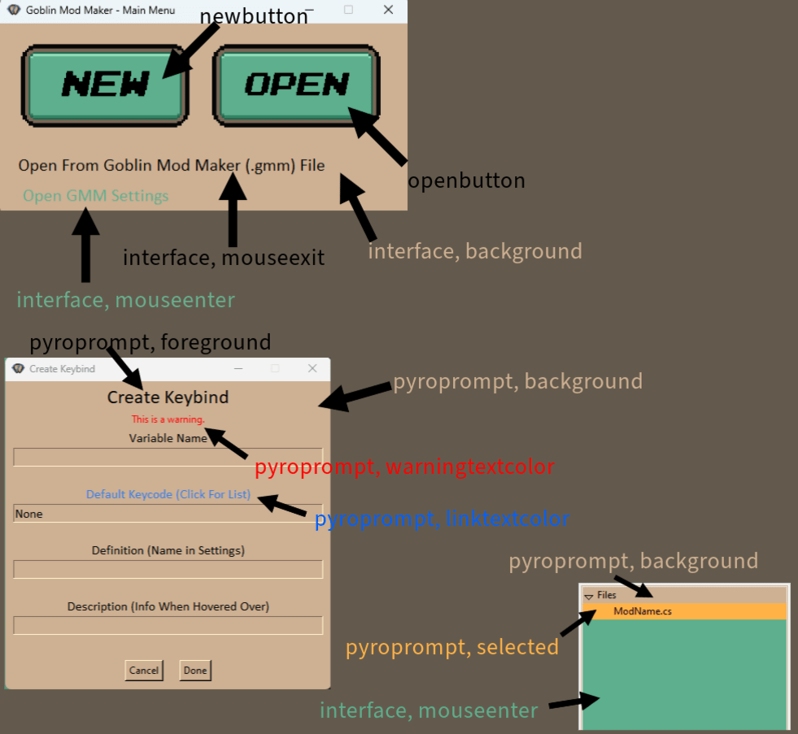

- Lines 8-26 deal with the actual theming of the app.
- Seen in the image above you can see what value goes with what
- The theme used in the image is *Isle Goblin*
- Feel free to tweak your theme to your liking
- When you are done please post your theme in the [Discord](https://discord.gg/ZbeuzR2rRC)
- ***NOTE: MAKE `openbuttonbackground`, `newbuttonbackground`, and `buttonconfig, background` EQUAL TO THE BACKGROUND COLOR***

---

### Adding Custom Fonts

## Errors

If you encounter errors with the mod maker itself, you can:

- Join the [Isle Goblin Modding Discord Server](https://discord.gg/vKy7YHPMmx).
- Check out the [Isle Goblin Wiki Modding Section](https://islegoblin.wiki/wiki/Modding_for_Isle_Goblin#Errors) for a detailed error-handling guide.

### Known Errors

#### Mod Menu Not Showing Up

1. Go to the [BepInEx ConfigManager](https://thunderstore.io/c/valheim/p/Azumatt/Official_BepInEx_ConfigurationManager/) page.
2. Click **Manual Download**.
3. Extract the downloaded zip file.
4. Once extraction is complete, you can delete the zip file.
5. Open the extracted folder.
6. Inside, navigate to `BepInEx > plugins > ConfigurationManager`.
7. Open your **Isle Goblin Playtest** folder.
8. Navigate to `BepInEx > plugins`.
9. Drag and drop the `ConfigurationManager.dll` from the extracted folder into your `Isle Goblin Playtest > BepInEx > plugins` folder.
10. Start Isle Goblin, and the mod menu should appear.

---

## Support

### Discord Server

#### If you join our [discord server](https://discord.gg/ZbeuzR2rRC) you can get support from the devs and community!
