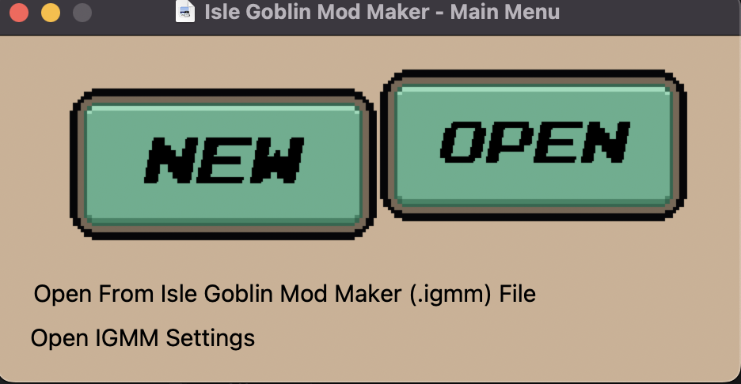
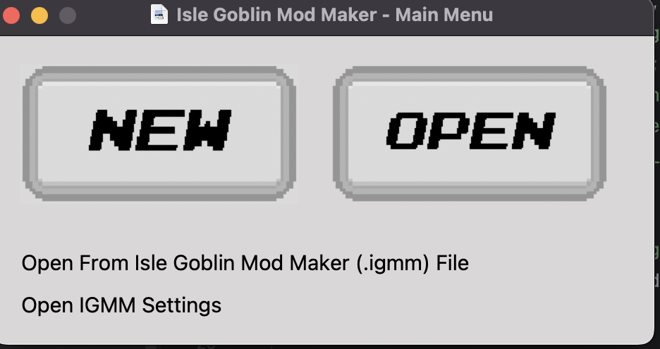
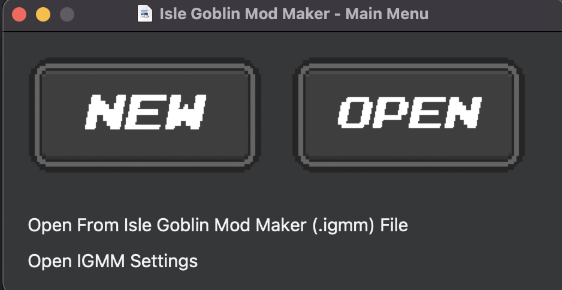
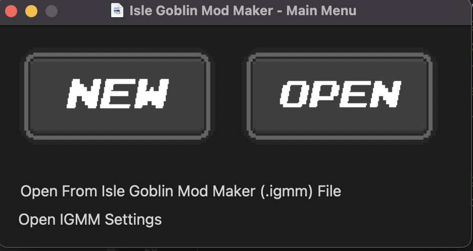
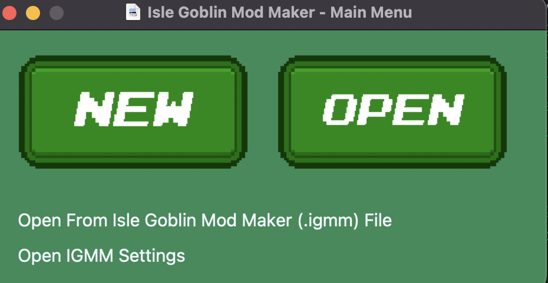
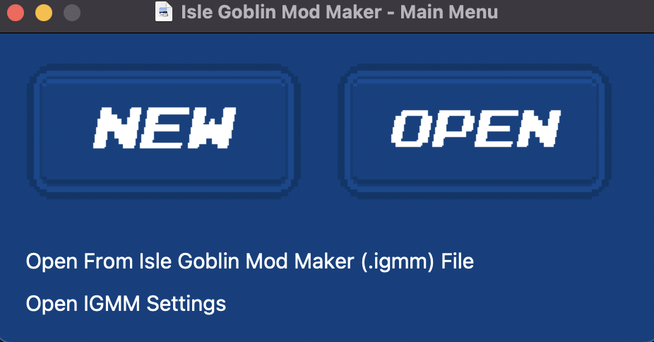
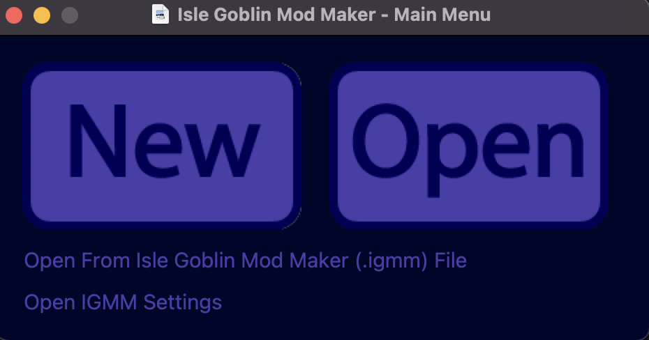

# Isle Goblin Mod Maker

### DOCUMENTATION IS BEING MADE. IF YOU SEE THE DOCUMENTATION.MD FILE BE AWARE IT MIGHT NOT BE FULLY CORRECT

## Devs

* EchoTheDeveloper
* SpiralDev

## Credits
Credits to Watt Designs for making Isle Goblin [Watt Designs Youtube Channel](https://www.youtube.com/@WattDesigns) | [Kilowatt games discord server](https://discord.gg/TM8n7ENJPa) | [Watt Designs patreon](https://www.patreon.com/WattDesigns)

Credits to HippoLippo for making the original Unity Mod Maker [HippoLippo's Mod Maker](https://github.com/HippoLippo/Unity-Mod-Maker)

Credits to SpiralDev for updating/working on the modding page of the wiki (@spirallikespc on Discord)

## Licence

Licence is the Apache 2.0 licence found in the licence file, or at [Apache v2 licence](https://www.apache.org/licenses/LICENSE-2.0)

## Install Instructions and Usage

I would recommend following the guide on the wiki: [Isle Goblin wiki, modding page. Using Mod Summar](https://islegoblin.wiki/wiki/Modding_for_Isle_Goblin#Using_Mods_Summary)

## Help

If you need help just join the Isle Goblin Modding discord server and ask in any of the help channels! [Isle Goblin Modding Discord Sever](https://discord.gg/vKy7YHPMmx)

## Author

This is a fork of the Unity Mod Maker by HippoLippo being continued by EchoTheDeveloper and Spiral.

# Themes

## Default:

## Light:

## Dark:

## Midnight:

## Forest:

## Ocean:

## Retro:

