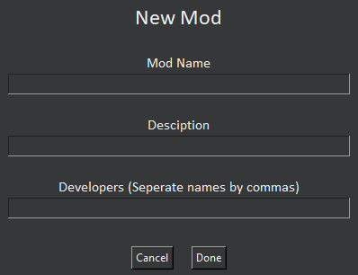
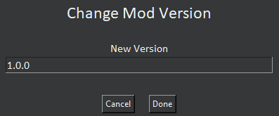

# Isle Goblin Mod Maker

### DOCUMENTATION IS BEING MADE. IF YOU SEE THE DOCUMENTATION.MD FILE BE AWARE IT MIGHT NOT BE FULLY CORRECT

## Devs

* EchoTheDeveloper
* SpiralDev

## Credits
Credits to Watt Designs for making Isle Goblin [Watt Designs Youtube Channel](https://www.youtube.com/@WattDesigns) | [Kilowatt games discord server](https://discord.gg/TM8n7ENJPa) | [Watt Designs patreon](https://www.patreon.com/WattDesigns)

Credits to HippoLippo for making the original Unity Mod Maker [HippoLippo's Mod Maker](https://github.com/HippoLippo/Unity-Mod-Maker)

Credits to SpiralDev for updating/working on the modding page of the wiki (@spirallikespc on Discord)

## Licence

Licence is the Apache 2.0 licence found in the licence file, or at [Apache v2 licence](https://www.apache.org/licenses/LICENSE-2.0)

## Install Instructions and Usage

I would recommend following the guide on the wiki: [Isle Goblin wiki, modding page. Using Mod Summar](https://islegoblin.wiki/wiki/Modding_for_Isle_Goblin#Using_Mods_Summary)

## Help

If you need help just join the Isle Goblin Modding discord server and ask in any of the help channels! [Isle Goblin Modding Discord Sever](https://discord.gg/vKy7YHPMmx)

## Author

This is a fork of the Unity Mod Maker by HippoLippo being continued by EchoTheDeveloper and Spiral.

# Themes

## Default:

## Light:

## Dark:

## Midnight:

## Forest:

## Ocean:

## Retro:

# Feature Overview:
## For the sake of this turial, everything will be done using the dark theme and all screenshots are provided from the source code of version v1.3.0 by developer SpiralDev
## New Mod:

* Mod Name: This is where you enter the name of your mod. Can be changed later.
* Description: This is a description of your mod for the manifest.json file. Can be changed in manifest.json after building.
* Developers: If entering multiple, seperate with a comma. Can be changed later.

## Mod Maker Settings:

* Default Game Folder: Set to Isle Goblin Playtest because of the current beta version of the game.
* Default Steam Directory: Can be found automatically (RECOMMENDED), the common folder where steam games are held.
* Select Themes: A dropdown box to select themes. automatically scans themes. See the Making Your Own theme section below. Will reapply theme on startup
* Show Line Numbers: If checked line numbers will be shown in the text editor.

## Rename Mod

* New Mod Name: The name that your mod will be renamed too.

## Change Mod Version

* Enter the new version of your mod (use semantic versioning -> major.minor.patch) for example isle goblin is on major 1, minor 3 and patch 0 at the time if writing this.

## Change Developers

* Developer Names: Enter the name of the developer(s) that are working on the mod. Seperate names with a comma.

## Go To Line

* Enter a line number and it will take you to that line in code. To view line numbers make sure it is turned on in the settings.

## Search

* Allows you to search for things in code.
